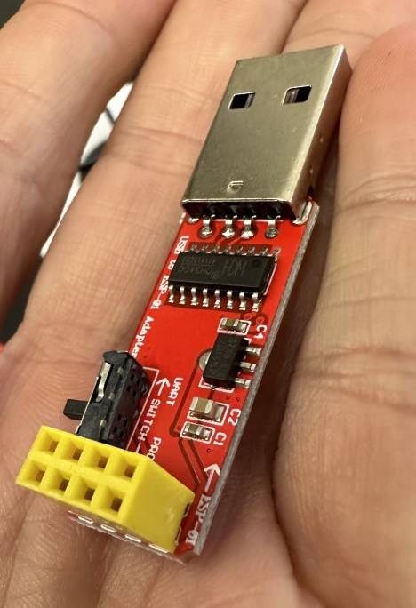
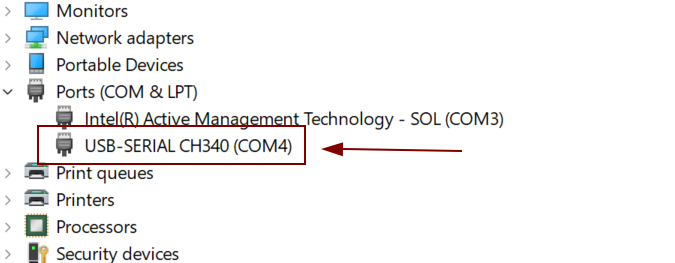
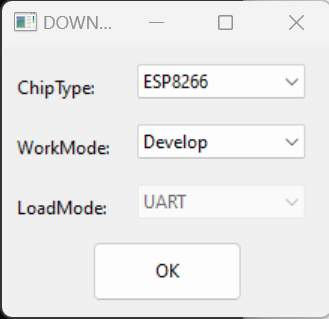
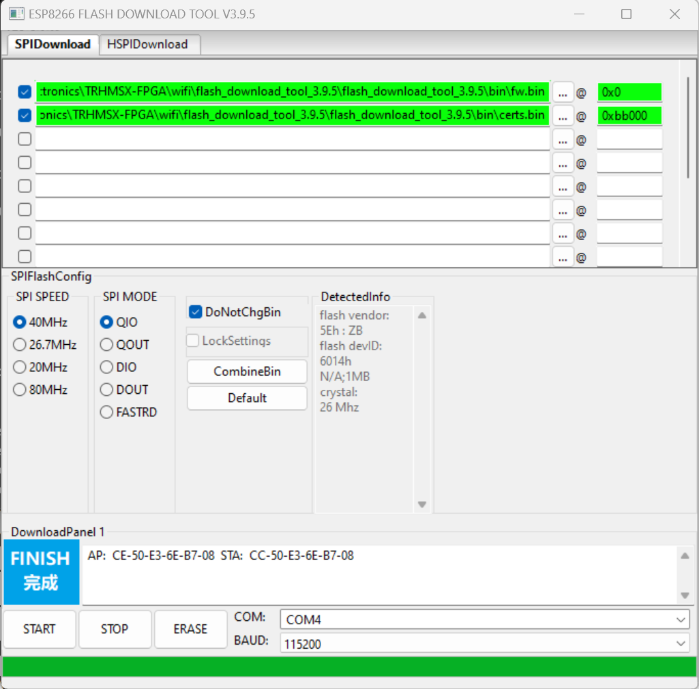
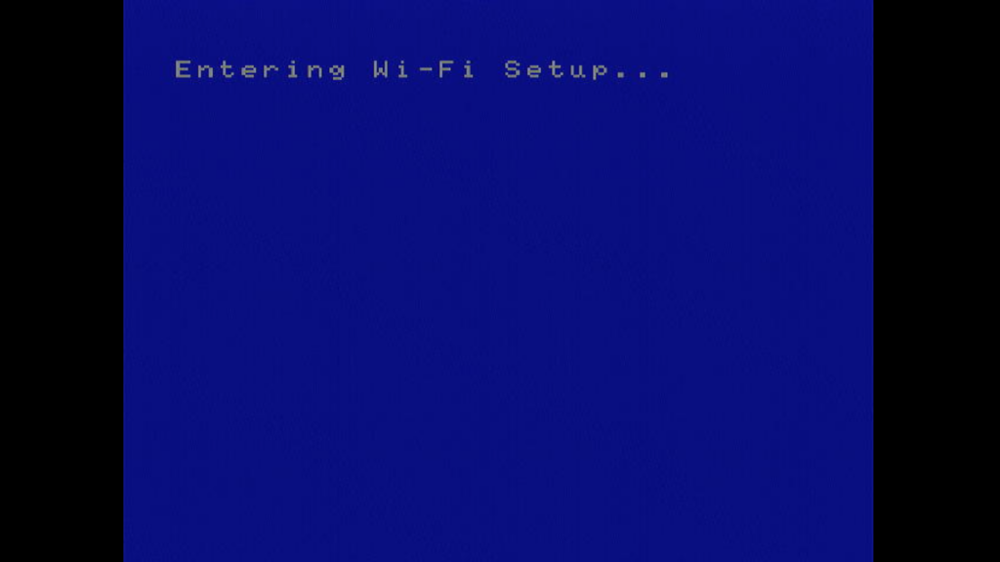

# Introduction

MSX computers hold a significant place in computing history, and their legacy continues to be celebrated through innovative approaches like FPGA synthesis. Field-Programmable Gate Arrays (FPGAs) provide a unique platform for recreating the MSX architecture, offering a flexible and efficient way to re-create the hardware. 

This synthesis enables enthusiasts to experience the charm of MSX systems without relying on original, often scarce, hardware components. FPGA-based MSX simulations can faithfully replicate the distinctive features of these iconic computers, including the Z80 processor, graphics capabilities, and sound architecture. 

This modern approach not only preserves the nostalgia associated with MSX but also opens up possibilities for enhancements and customizations. FPGA synthesis ensures that the MSX spirit endures, catering to both seasoned aficionados and new generations eager to explore the roots of personal computing.

**WARNING!** If you use this project to implement your own hardware, remember as per the license you must release the modified files under the same license. I've seen multiple projects based on files I publish on Github that were never released to the public, and I think that's a shame (and violation of the license!).

# TRHMSX - A Simple FPGA MSX2+ clone (with additional features)
**WARNING!** If you use this project to implement your own hardware, remember as per the license you must release the modified files under the same license. I've seen multiple projects based on files I publish on Github that were never released to the public, and I think that's a shame (and violation of the license!).

# TRHMSX - A Simple FPGA MSX2+ clone (with additional features)

This FPGA-based MSX2+ hardware represents a straightforward implementation, drawing inspiration from the original 1chipMSX circuit but featuring several enhancements and a new PCB design for improved functionality. Despite its advanced capabilities, the primary focus during development was on maintaining a low-cost solution.

The core of this system is the Cyclone I FPGA, accompanied by a few additional components. The PCB is a 4-layer board measuring 12x15 cm. The FPGA is a 240-pin package, which is challenging to solder manually. Instead, using an SMT oven or a hot air station is advised for optimal results. For those opting for a hot air station, employing a stencil to apply solder paste is highly recommended, significantly streamlining the assembly process.

| kicad 3D model | First prototype|
|---------|---------|
|  | .jpg) |

Programming the FPGA requires the well-known KDL ESE MSX2+ core, available for download [here](https://gnogni.altervista.org/). This core ensures the proper functioning of the MSX2+ hardware, providing users with a reliable and authentic MSX experience on this FPGA-based system.

## Features

* **MSX2+ Compatibility**: Reproducing the MSX2+ architecture, ensuring compatibility with a wide range of software and games.
* **Expanded Memory Options**: Choose between 2MB or 4MB of mapped RAM, providing users with flexibility for diverse computing needs and applications.
* **9958 Video Display Processor (VDP)**: Incorporating the 9958 VDP for sharp graphics and improved visual performance, delivering an authentic MSX experience.
* **FM and SCC Sound Capabilities**: Featuring FM synthesis and SCC sound to reproduce the iconic audio characteristics of MSX systems, enhancing the overall gaming and multimedia experience.
* **Programmable Sound Generator (PSG)**: Including the original PSG for standard MSX audio output.
* **Keyboard Compatibility**: Supporting PS/2 keyboards with the option for USB keyboards, providing users with a choice for their preferred input device.
* **MicroSD Card Support**: Integrating a microSD card slot for convenient storage and easy access to files, games, and software.
* **MSX Cartridge Slots**: Equipped with two MSX cartridge slots, allowing users to explore a vast library of MSX cartridges for an extended range of applications and games.
* **Dual Joystick Ports**: Featuring two joystick ports for multiplayer gaming and compatibility with classic MSX peripherals.
* **Wireless Network Support**: Incorporating wireless network support through the ESP8266, enabling online connectivity and expanding the possibilities for networked applications.
* **12V Cartridge Lines**: Providing dedicated 12V lines for cartridges, ensuring compatibility with a variety of peripherals and accessories.

## Open Source

This project stands as a testament to the spirit of open source collaboration. Over the years, the original 1chipMSX circuit has inspired numerous clones, some even commercially implemented, each potentially harboring unique modifications. Regrettably, many of these adaptations were never shared with the broader community. In response, this project emerges as a fresh implementation of the original circuit, introducing enhancements and a redesigned PCB.

What sets this initiative apart is its commitment to transparency. From the project's inception, the goal was clear: to share all design files openly. This includes not only the schematics and PCB layout but also the Bill of Materials (BOM) and any other essential documentation for recreating the project.

In stark contrast to its predecessors, this project was conceived with a dedication to community collaboration. If you choose to utilize these resources to construct your own MSX2+ clone or find ways to enhance it, I encourage you to contribute back to the community. Share your experiences, document any improvements you make, and actively participate in the collective evolution of this open source endeavor.

Let this project serve as a reminder of the **reciprocal nature of open source**. By using and benefiting from open source projects, it becomes a responsibility to give back, ensuring the continued growth and enrichment of the shared knowledge pool within the community.

## Bill of materials

[More info to come]

## Building

To build the project you will need the following tools and resources:

* [Quartus Prime Lite Edition](https://fpgasoftware.intel.com/?edition=lite)
* [Quartus Prime Programmer](https://fpgasoftware.intel.com/18.1/?edition=lite&platform=windows&download_manager=dlm3)
* [USB Blaster drivers](https://fpgasoftware.intel.com/18.1/?edition=lite&platform=windows&download_manager=dlm3)
* [OCM-PLD Pack](https://gnogni.altervista.org/ocm/20221127%20OCM-PLD%20Pack%20v3.9.1%20by%20KdL.7z)

## Programming

### FPGA
### FPGA
To program the FPGA you will need a USB Blaster. 
[More info to come]

### Wireless Network Module

Wireless network access in the TRH MSX is performed by the use of a 8266 ESP-01 module by Espressif and via the ESP8266 Wi-Fi Support Pack v1.0 shared by KDL as the result of the work of Oduvaldo Pavan Jr. The software created by Oduvaldo is licensed under the GNU Lesser General Public License v2.1 as open source and it is available both from the KDL original web page as well as directly from Oduvaldo's GitHub repository at https://github.com/ducasp/ESP8266-UNAPI-Firmware/ 

Note: Oduvaldo has been working in optimized versions of the ESP8266 module to be used with other FPGA based computers and those may not be compatible with the TRHMSX. Please use the one shared by KDL as it was built to be used with the basic Verilog/VHDL ESEMSX.

#### Programming the ESP8266 module

To program the ESP-01 module you will need a CH340 USB to ESP8266 ESP01 Serial Programmer like the one shown in the below picture. You can purchase one of those directly from AliExpress here (the link is also available on the Bill of Materials table in this document).

Follow the instructions detailed below to program your ESP8266 module:

1. Download the ESP8266 Wi-Fi Support Pack v1.0 from the KDL page here. 
2. Make sure the switch on the programmer is configured to PROG.
3. Connect the ESP-01 module to the programmer and insert it to your PC USB port. Open device manager and check the COM port assigned to the programmer. Make sure you have the appropriate CG340 driver installed, if required download and install the driver from wch.cn/downloads/CH341SER_EXE.html

4. Download Espressif Flash Download Tools from Tools | Espressif Systems
5. Unzip and execute the Flash Download tool from the downloaded zip package. 
6. If asked, select the ESP8266 ChipType and Develop as the WorkMode. Click OK to run the flash download tool.

7. Click the elipsis on the first two lines and make sure to select certs.bin and fw.bin from the package downloaded from the KDL page. Those files are located on the bin folder after unziping the package.  Use 0x0 as the start address for fw.bin and 0xbb000 for certs.bin. Also make sure to select the same COM port as the port identified previously as being used by the CH340 programmer. Reference to the picture below when running the flash download tool to program your ESP8266 module.

8. The ESP8266 is now ready to be inserted into the TRH MSX pin header dedicated to host the module.

#### Using the TRHMSX with Wireless 

To connect the TRHMSX to your wireless network you need first program the 8266 module according to the instructions previously documented. Then go ahead and plug the module to the appropriate pin headers on the board. Make sure you are connecting it with the right orientation. The location of the header was intentionally chosen to avoid wrong connections as the board cannot be over the SMD electrolytic capacitors located nearby.

Now turn on the TRHMSX and push the F1 key. Keep it pushed until you see the message shown below.

| Entering Network Setup | Config Menu|
|---------|---------|
||

Note that the second screen already shows it is connected to my local wireless network. You may get a message saying the module is still not connected to any access point. 

Using option 3 you can select a network to connect and provide appropriate credentials. The other options change specific firmware configurations. Please consult the firmware documentation to obtain details on the options and specific configurations.

After connecting the module to your wireless network you can use any UNAPI compatible tool from the computer. Just be aware that the AT firmware variant implemented by Oduvaldo doesn't support ICMP, thus the PING command that we normally use to test the OBSONETs and other traditional network cards will not work from the TRHMSX with the ESP8266 module.

### +12V/-12V Cartridge Lines

Certain MSX cartridges utilize both the +12V and -12V lines, such as specific variants of OPL4 cartridges and the RBSC Carnivore2. Those lines are crucial for powering the operational amplifiers responsible for audio output.

In the case of the TRHMSX, the +-12V lines are generated through a simple board connected to the relevant pin headers on the motherboard. This board serves as a simple step-up mechanism and can easily be obtained from AliExpress here.

### microSD Card
To use the microSD card you will need... [More info to come]

## License

This work is licensed under a [Creative Commons Attribution-NonCommercial-ShareAlike 4.0 International License](http://creativecommons.org/licenses/by-nc-sa/4.0/).

This work is licensed under a [Creative Commons Attribution-NonCommercial-ShareAlike 4.0 International License](http://creativecommons.org/licenses/by-nc-sa/4.0/).

* If you remix, transform, or build upon the material, you must distribute your contributions under the same license as the original.
* You may not use the material for commercial purposes.
* You must give appropriate credit, provide a link to the license, and indicate if changes were made. You may do so in any reasonable manner, but not in any way that suggests the licensor endorses you or your use.
* If you remix, transform, or build upon the material, you must distribute your contributions under the same license as the original.
* You may not use the material for commercial purposes.
* You must give appropriate credit, provide a link to the license, and indicate if changes were made. You may do so in any reasonable manner, but not in any way that suggests the licensor endorses you or your use.

**ATTENTION**
**ATTENTION**

This project was made for the retro community and not for commercial purposes. So only retro hardware forums and individual people can build this project.
This project was made for the retro community and not for commercial purposes. So only retro hardware forums and individual people can build this project.

THE SALE OF ANY PART OF THIS PROJECT WITHOUT EXPRESS AUTHORIZATION IS PROHIBITED!
THE SALE OF ANY PART OF THIS PROJECT WITHOUT EXPRESS AUTHORIZATION IS PROHIBITED!

